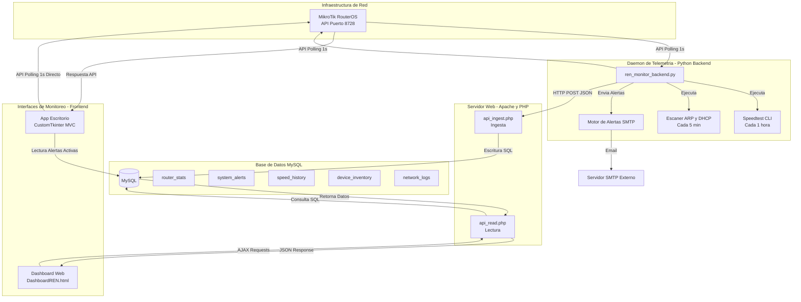

# Diagrama de Arquitectura Unificada

> Documento fuente: [architecture.md](../architecture.md)

Interacción de todos los elementos del sistema, desde la infraestructura física hasta las interfaces de cara al usuario.

