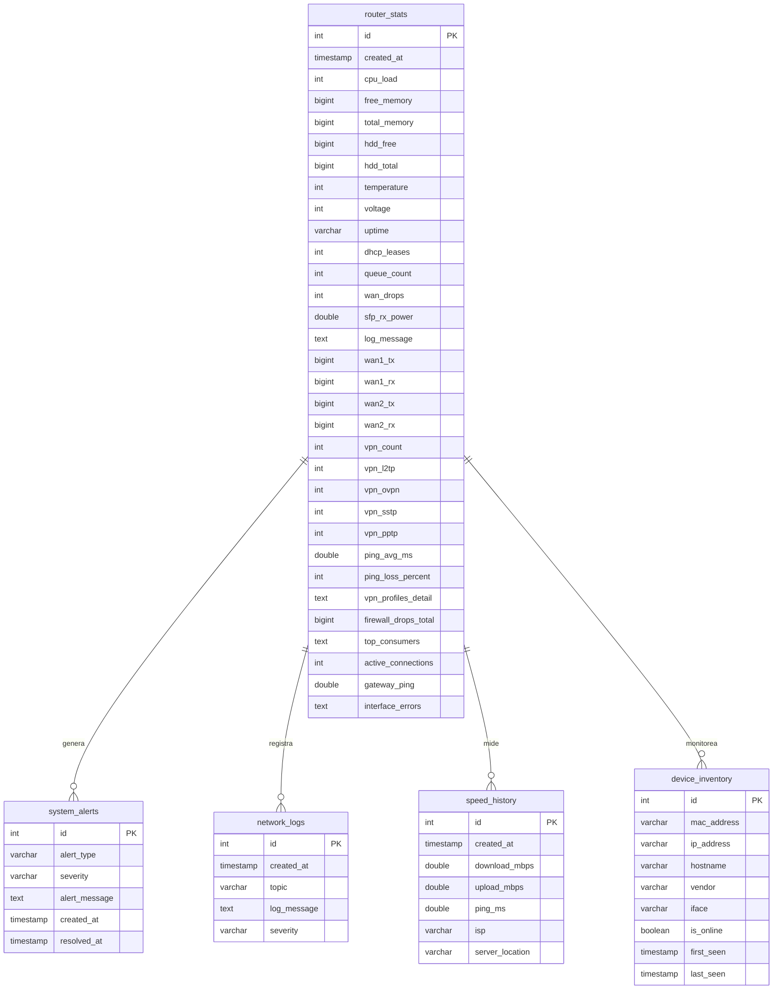

# Diagrama Entidad-Relación (ER) - Base de Datos

> Documento fuente: [database_schema.md](../database_schema.md)

Sistema orientado a telemetría de series de tiempo. Las tablas están diseñadas para lecturas rápidas e inserciones masivas optimizadas mediante índices en campos temporales.

