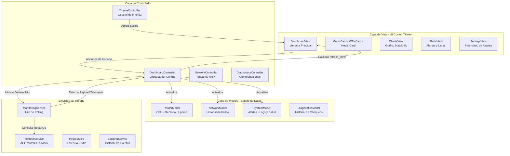

# Diagrama MVC - Aplicación de Escritorio

> Documento fuente: [desktop_app.md](../desktop_app.md)

Arquitectura Modelo-Vista-Controlador de la aplicación de escritorio desarrollada en Python 3 con CustomTkinter.

